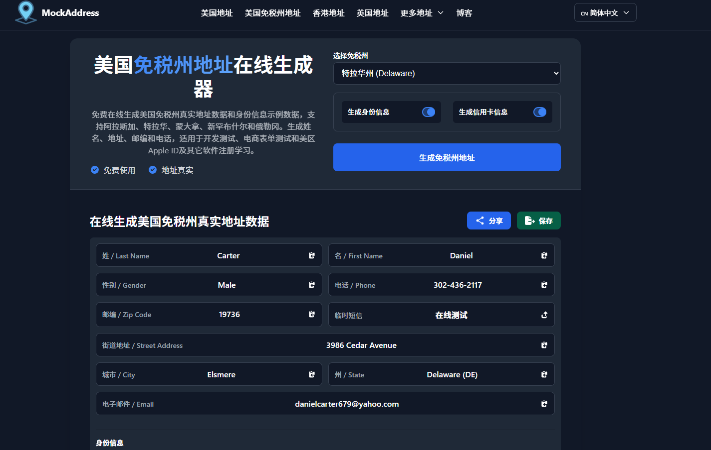

# 真实随机美国免税州地址生成器

[](LICENSE)
[]()
[]()
[]()
[]()
[]()
[]()

> 本仓库包含 MockAddress 的**开源前端核心引擎**，用于生成跨多个国家/地区的真实格式测试地址和 MAC 地址数据。  
> 完整生产环境网站：<https://mockaddress.com/>  
> 
> 🇬🇧 **English users please see: [README_EN.md](./README_EN.md) (English Documentation)**



## 项目简介

MockAddress Core 是一个**纯前端、零后端依赖**的测试数据引擎，专为开发者和 QA 工程师设计，提供：

- **真实格式地址数据**，符合官方邮政标准（可在 Google Maps / Apple Maps 验证）
- 可选的**身份字段 + 信用卡字段**（仅用于表单/支付流程测试）
- **MAC 地址生成 + 厂商查询 + IPv6 Link-Local 推导**等网络测试数据

所有核心逻辑完全在浏览器端运行，可直接部署到任何静态托管环境（GitHub Pages、Cloudflare Pages、Vercel 等）。

> **注意**：本仓库仅开源**引擎和基础样式**。  
> 大规模地址数据集和生产站点页面模板仍为 MockAddress 私有资产，用于在线服务。

---

## 主要特性

- **多国家/地区地址生成（引擎支持）**
  - 支持为多个国家/地区生成符合本地邮政标准的地址结构
  - 地址字段包含完整信息：街道、城市、州/省、邮编、国家等
  - 可根据国家扩展本地化字段（如日本地址层级、香港中英文地址等）

- **真实格式 & 可验证**
  - 地址数据基于官方邮政/统计数据 + OpenStreetMap 等公开数据源，经过清洗和整理
  - 生成结果在设计上**可在 Google Maps / Apple Maps 等地图服务中验证**
  - 适用于注册表单、支付页面、税费计算逻辑等对地址格式要求严格的场景

- **可选身份 & 信用卡字段（仅测试用）**
  - 可选生成姓名、性别、生日、职业、本地化身份证号格式等
  - 可选生成信用卡号（通过 Luhn 校验）、有效期、CVC 等字段
  - 所有身份/卡片数据均为**随机生成，不对应任何真实个人或真实卡片**

- **批量导出 & 自动化友好**
  - 内置 CSV / JSON 导出能力
  - 适合自动化测试、回归测试、CI/CD 流水线批量注入测试数据

- **MAC 工具**
  - 生成多种格式的 MAC 地址（冒号、短横、点、无分隔等）
  - 基于 OUI 数据集进行厂商识别
  - 支持从 MAC 推导 IPv6 Link-Local 地址
  - 所有逻辑在浏览器本地完成，适用于网络测试、设备模拟、脚本开发

- **纯前端、隐私优先**
  - 不依赖后端服务，全部逻辑在前端 JS 中完成
  - 可选将生成结果保存到浏览器 `localStorage`，服务器不存储任何生成数据

---

## 仓库结构

```
mockaddress-core/
├── src/
│   ├── js/
│   │   ├── address-generator.js     # 地址/身份/信用卡生成引擎
│   │   ├── mac-generator.js         # MAC 生成与厂商查询
│   │   ├── storage.js               # 存储、限流、导出工具
│   │   ├── language-switcher.js     # 多语言路由与内部链接重写
│   │   ├── utils.js                 # 通用工具函数
│   │   └── config.js                # 配置模块
│   └── css/
│       └── main.css                 # 通用暗色主题与基础 UI 组件样式
├── README.md                         # 项目文档（本文件）
├── README_EN.md                      # 英文文档
├── LICENSE                           # 开源协议（MIT）
├── CONTRIBUTING.md                   # 贡献指南
├── ROADMAP.md                        # 路线图
└── .gitignore                        # Git 忽略规则
```

> **提醒**：**本仓库不包含生产站点 HTML 文件和大规模数据文件 `data/*.json`**。  
> 这些用于在线部署，不属于本次开源发布。

---

## 使用方式

### 快速开始

**方式一：直接使用（如果你的数据目录是 `data/`）**

```html
<script type="module">
  import { generateUSAddress } from './src/js/address-generator.js'
  
  // 直接使用，会自动检测 data/ 目录
  const address = await generateUSAddress('CA')
  console.log(address)
</script>
```

**方式二：自定义数据路径（推荐）**

```html
<script type="module">
  // 1. 导入配置模块
  import { configure } from './src/js/config.js'
  import { generateUSAddress } from './src/js/address-generator.js'
  
  // 2. 配置你的数据路径
  configure({
    dataBasePath: 'my-data/',  // 你的数据目录
    autoDetectPaths: false     // 禁用自动检测
  })
  
  // 3. 正常使用
  const address = await generateUSAddress('CA')
  console.log(address)
</script>
```

### 配置选项

- **`dataBasePath`**：你的数据文件基础路径（如 `'my-data/'`、`'/static/data/'`）
- **`autoDetectPaths`**：是否启用自动路径检测（默认 `true`，适合 mockaddress.com 的多语言结构）

> **重要**：如果你不调用 `configure()`，代码会使用默认行为，**完全不影响 mockaddress.com 的正常运行**。

### 可用函数

- `generateUSAddress(state)` - 美国地址
- `generateHKAddress(region, isEnglish)` - 香港地址
- `generateUKAddress(region)` - 英国地址
- `generateCAAddress(province)` - 加拿大地址
- `generateJPAddress(prefecture)` - 日本地址
- `generateINAddress(state)` - 印度地址
- `generateTWAddress(county)` - 台湾地址
- `generateSGAddress(state)` - 新加坡地址
- `generateDEAddress(state)` - 德国地址
- `generateTaxFreeAddress(state)` - 美国免税州地址
- `generateIdentityInfo(address)` - 身份信息
- `generateCreditCardInfo()` - 信用卡信息（测试用）

### 代码示例

**生成美国免税州地址：**

```javascript
import { generateTaxFreeAddress } from './src/js/address-generator.js';

// 生成俄勒冈州（免税州）地址
const address = await generateTaxFreeAddress('OR');
console.log(address);
// 输出: { street: "123 Main St", city: "Portland", state: "OR", zip: "97201", ... }
```

**生成地址 + 身份信息：**

```javascript
import { generateUSAddress, generateIdentityInfo } from './src/js/address-generator.js';

const address = await generateUSAddress('CA');
const identity = generateIdentityInfo(address);
console.log({ ...address, ...identity });
// 输出包含: name, gender, dateOfBirth, occupation, ssn 等
```

**生成 MAC 地址：**

```javascript
import { generateMACAddress, lookupVendor } from './src/js/mac-generator.js';

const mac = generateMACAddress('colon'); // 'aa:bb:cc:dd:ee:ff'
const vendor = await lookupVendor(mac);
console.log(vendor); // 来自 OUI 数据库的厂商信息
```

**导出为 CSV/JSON：**

```javascript
import { exportToCSV, exportToJSON, getAllSavedAddresses } from './src/js/storage.js';

// 保存一些地址后
const addresses = getAllSavedAddresses();
const csv = exportToCSV(addresses);
const json = exportToJSON(addresses);

// 下载或使用导出的数据
console.log(csv);
console.log(json);
```

详细使用说明请参考 [`使用说明.md`](./使用说明.md)。

你也可以参考我们的生产站点 <https://mockaddress.com/> 查看真实使用场景和 UI 设计，然后在自己的项目中按需定制。

---

## 部署示例：Cloudflare & VPS（静态托管）

> 下列步骤是给要自己部署 mockaddress-core 的开发者看的，只描述最简单的路径，供 README 使用。

### 使用 Cloudflare Pages 部署（推荐给前端 / 无运维成本场景）

1. 在 GitHub 上创建仓库（例如 `mockaddress-core`），把本项目代码推送上去。
2. 登录 Cloudflare，进入 **Pages**，选择「使用 Git 提供商创建项目」，绑定这个仓库。
3. 构建设置：
   - 框架预设：**None / 静态站点**
   - 构建命令：留空（或 `npm run build`，如果你将来加了打包流程）
   - 输出目录：设置为项目根目录（或者你的打包输出目录）
4. 部署后，确保：
   - 所有 JS/CSS 通过 `<script type="module">` / `<link>` 相对路径正常加载；
   - 如果有多语言子目录结构（如 `/en/`、`/ru/`），在仓库中保持同样的目录层级即可。

> **备注**：如果你只想开源核心，不想暴露完整站点，可以只部署一个最小的演示页面（或干脆只放截图，在 README 中引导访问正式站点）。

### 使用 VPS + Nginx 部署（适合已有服务器）

1. 在本地构建或整理好静态文件结构（`src/js`、`src/css` 以及你的 HTML 入口）。
2. 将这些静态文件上传到 VPS（例如 `/var/www/mockaddress-core` 目录）。
3. 配置 Nginx 站点（示例）：

```nginx
server {
    listen 80;
    server_name your-domain.com;

    root /var/www/mockaddress-core;
    index index.html;

    location / {
        try_files $uri $uri/ =404;
    }
}
```

4. 重载 Nginx：`nginx -s reload` 或使用对应的服务管理命令。
5. 打开浏览器访问 `http://your-domain.com`，确认地址生成/MAC 工具等功能正常工作。

> **VPS 部署的本质**：就是把这套前端文件当作**纯静态站**托管，不需要 Node.js / PHP / 数据库等后端环境。

---

## 数据来源与真实性（简要说明）

完整数据来源与更详细的权威性说明可以参考我们线上公开的 llms 文档。这里只做简要概括：

- 主要基于各国官方公布的邮政/统计数据、地理数据
- 辅以 OpenStreetMap / GeoNames / OpenAddresses 等开源地理数据项目
- 通过自定义规则进行清洗与随机组合，保证：
  - 地址结构符合本地邮政标准
  - 地址内容在设计上可被主流地图服务验证
  - 不与任何真实个人身份直接关联

---

## 开源范围与非开源部分

**本仓库开源的内容包括：**

- 地址/身份/信用卡字段生成的前端引擎逻辑
- MAC 生成与厂商查询的前端逻辑
- 与上述引擎配套的基础 UI 样式（CSS）
- 与多语言静态站相关的通用路由工具（如 `language-switcher.js`）

**不包含的内容包括但不限于：**

- 正式线上站点的 HTML 页面模板与所有文案
- 大规模地址数据文件（`data/*.json` 等生产数据集）
- 内部运维脚本、部署配置等

---

## 适用与不适用场景（重要）

**适用场景（示例）：**

- 软件开发与测试环境
- 表单验证逻辑测试
- 跨境电商 / 跨境业务的地址填写流程模拟
- UI/UX 原型演示
- 教学演示与技术分享
- 网络测试与设备模拟（MAC 工具）

**不适用场景：**

- 真实邮寄与收货地址
- 长期实名账号注册与经营
- 规避 KYC / 风控 / 法律监管的用途
- 一切违法或灰色用途

---

## 路线图（示例）

后续我们计划逐步在开源核心里做的事情包括（实际以 `ROADMAP.md` 为准）：

- 提供更清晰的 TypeScript 类型定义
- 拆分各国地址生成逻辑，方便单独扩展/按需引入
- 丰富导出格式与集成示例，便于接入 CI/CD 流程
- 根据社区反馈增加更多国家/地区的地址格式支持

---

## 线上示例与联系

- **生产站点（完整产品，多语言）**：
  - 中文站：<https://mockaddress.com/>
  - 英文站：<https://mockaddress.com/en/>
  - 俄文站：<https://mockaddress.com/ru/>
  - 西班牙语站：<https://mockaddress.com/es/>
  - 葡萄牙语站：<https://mockaddress.com/pt/>
- 关于本站的更多背景与说明，请参考站内的 About/Help/Blog 页面。

如果你在使用过程中有任何问题、建议，欢迎通过 Issue 或 PR 的方式参与，共同改进这套前端测试数据引擎。

---

## GitHub Topics

**推荐的主题标签（复制粘贴到 GitHub 仓库设置中）：**

### 核心功能标签
```
address-generator, random-address, fake-address, tax-free-state, real-address, 
random-us-address, random-address-generator-for-testing, us-dummy-address-generator
```

### 地区地址标签
```
hong-kong-address-random, random-address-in-hong-kong, hong-kong-random-address,
japan-address-generator-tokyo, random-japan-address, taiwan-address-format, 
taiwan-address-sample, canada-address, uk-address, india-address, singapore-address
```

### 技术栈标签
```
javascript, frontend, browser-only, no-backend, static-site, 
privacy-first, openstreetmap, address-validation, postal-standards
```

### 使用场景标签
```
test-data, devtools, qa, testing, mock-data, form-testing, 
automation, ci-cd, csv-export, json-export, mac-address
```

**快速复制（所有主题）：**
```
address-generator, random-address, fake-address, tax-free-state, real-address, random-us-address, random-address-generator-for-testing, us-dummy-address-generator, hong-kong-address-random, random-address-in-hong-kong, hong-kong-random-address, japan-address-generator-tokyo, random-japan-address, taiwan-address-format, taiwan-address-sample, javascript, frontend, test-data, devtools, qa, testing, mock-data, browser-only, privacy-first, csv-export, json-export, mac-address
```

---

## License

本项目采用 MIT 许可证 - 详见 [LICENSE](LICENSE) 文件。

---

## 💰 支持与数据服务


### 加密货币打赏

你也可以通过加密货币支持我们：

**Ethereum / USDT (ERC-20):**
```
0x6Df562A8B669bf90EAe5ccB0E0440eb9DF237E4e
```


**USDT (TRC-20):**
```
TYz2SP7GtL84t14CeL7tnhHLgeako3haHW
```


> **注意**：加密货币打赏不可退款，请确认地址无误后再发送。


### 📊 数据服务支持

需要建站数据支持？欢迎随时联系我们，提供付费服务与技术协助。

📧 邮箱：[jietoushiren01@gmail.com](mailto:jietoushiren01@gmail.com)
